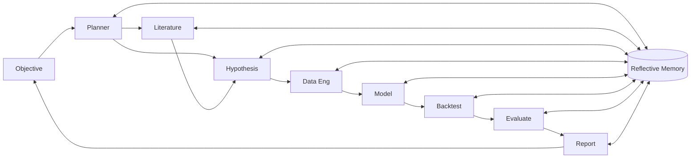

# QuantLab

**An Agentic AI Framework for End-to-End Quantitative Research and Alpha Discovery**

QuantLab is a multi-agent AI system that autonomously performs literature review, hypothesis generation, data engineering, model development, backtesting, evaluation, and reporting for quantitative finance. It is developed as an MSc thesis proposal for the ETH Zurich Agentic Systems Lab.

---

## Table of Contents

1. [Motivation](#motivation)
2. [Architecture](#architecture)
3. [Installation](#installation)
4. [Quickstart Demo](#quickstart-demo)
5. [Repository Layout](#repository-layout)
6. [Configuration](#configuration)
7. [Evaluation](#evaluation)
8. [Development](#development)
9. [Roadmap](#roadmap)
10. [License](#license)

---

## Motivation

Systematic alpha discovery is bottlenecked by human throughput: a researcher can meaningfully test only a handful of hypotheses per week. QuantLab treats the full research pipeline as a graph of specialised LLM agents, adds a reflective memory layer for cross-run learning, and enforces leakage-aware backtesting so that the throughput gain does not translate into a p-hacking gain.

The thesis contribution is not "another autonomous agent"; it is a rigorous evaluation of whether reflection and multi-agent coordination measurably improve out-of-sample research quality in a high-noise, adversarial domain.

## Architecture

Nine agents cooperate over a shared, versioned state:

- Research Planner Agent
- Literature Review Agent
- Hypothesis Generation Agent
- Data Engineering Agent
- Model Development Agent
- Backtesting Agent
- Evaluation Agent
- Research Report Agent
- Reflective Memory Agent



Full diagram and agent contracts: [`docs/01_System_Architecture.md`](docs/01_System_Architecture.md).

## Installation

```bash
git clone https://github.com/quantsingularity/QuantLab
cd QuantLab
python -m venv .venv && source .venv/bin/activate
pip install -e ".[dev]"
```

Requirements to run the PoC: Python 3.11+. That's it -- the PoC agents are
deterministic (no LLM calls yet, see [Roadmap](#roadmap)) and the Reflective
Memory Agent falls back to a local `runs/memory.jsonl` file when Postgres
isn't configured, so nothing else needs to be running.

Docker (`docker compose up -d postgres redis`) and an `OPENAI_API_KEY` (see
`.env.example`) are only needed for the v0.5 system once the agents call an
LLM and the memory store moves to Postgres + pgvector -- not for the PoC
described in this repo today.

## Quickstart Demo

Run the two-day PoC end to end:

```bash
python -m quantlab.run \
    --objective "Develop a momentum strategy for the NASDAQ 100" \
    --out ./runs/momentum_nasdaq
```

Or drive it from a config file instead of flags (see [Configuration](#configuration)):

```bash
python -m quantlab.run --config configs/momentum_nasdaq.yaml --out ./runs/momentum_nasdaq
```

Outputs:

```
runs/momentum_nasdaq/<run_id>/
├── report.md              # Auto-generated research report
├── report.pdf             # PDF rendering (skipped if reportlab isn't installed)
├── equity_curve.png       # Cumulative returns figure
├── equity_curve.parquet   # Raw equity curve
├── metrics.json           # Machine-readable metrics
├── trades.parquet         # Trade log
├── reflections.jsonl      # Per-stage critiques from the Reflective Memory Agent
└── state.json             # Full run snapshot
```

## Repository Layout

```
quantlab/
├── src/quantlab/
│   ├── agents/            # Nine agent implementations
│   ├── core/              # Graph, state, memory
│   ├── data/              # Loaders and caches
│   ├── strategies/        # Signal factories
│   ├── backtest/          # Vectorised engine + leakage guard
│   ├── evaluation/        # Financial + research-quality metrics
│   └── report/            # Markdown and PDF rendering
├── tests/                 # pytest + hypothesis
├── configs/               # yaml configs for objectives, budgets, models
├── docs/                  # Thesis exposé, architecture, evaluation
├── notebooks/             # Exploratory analysis
├── scripts/               # CLI entry points
└── docker-compose.yml
```

## Configuration

Objectives, universe, dates, and cost assumptions can be driven by a
declarative YAML file instead of CLI flags:

```yaml
# configs/momentum_nasdaq.yaml
objective: "Develop a momentum strategy for the NASDAQ 100"
universe: nasdaq_100
start: 2010-01-01
end: 2025-01-01
oos_start: 2022-01-01
transaction_cost_bps: 5
models:
  planner: gpt-4o
  hypothesis: gpt-4o
  summariser: gpt-4o-mini
  report: gpt-4o
budget:
  max_tokens_per_run: 400000
  max_usd_per_run: 5.0
```

`objective`, `universe`, `start`, `end`, `oos_start`, and
`transaction_cost_bps` are read by the Data Engineering, Backtesting, and
Evaluation agents today (`python -m quantlab.run --config configs/momentum_nasdaq.yaml`).
`models` and `budget` are not consumed yet -- the PoC's agents are
deterministic stubs with no LLM calls (see [Roadmap](#roadmap)); those
sections are the intended v0.5 interface for model routing and cost control
once real LLM calls land.

## Evaluation

The evaluation framework covers financial performance, research quality, system efficiency, and comparative baselines. See [`docs/03_Evaluation_Framework.md`](docs/03_Evaluation_Framework.md).

Run the comparative benchmark:

```bash
python -m quantlab.eval.run_benchmark --config configs/benchmark.yaml
```

Honest scope note: since the PoC's agents are deterministic, the benchmark
can't yet reproduce the single-agent or human-assisted baselines from the
thesis proposal -- those need the v0.5 LLM-driven agents. What it does give
you today, end to end, is a genuine reflective-vs-non-reflective ablation
(`use_reflection: true/false` in `configs/benchmark.yaml`), which is the
"non-reflective multi-agent baseline" row in `docs/03_Evaluation_Framework.md`.

## Development

```bash
pytest -q
ruff check src tests
mypy src
```

## Roadmap

See [`docs/04_Six_Month_Plan.md`](docs/04_Six_Month_Plan.md) for the full six-month thesis plan. High level:

- **M1** PoC and related-work chapter
- **M2** Full nine-agent system with reflective memory
- **M3** Evaluation harness and baselines
- **M4** Large-scale experiments and ablations
- **M5** Robustness studies
- **M6** Thesis writing and open-source release

## License

MIT. See `LICENSE`.
