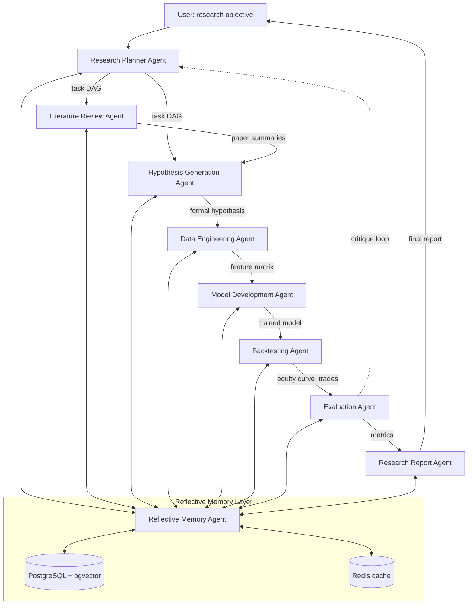

# QuantLab System Architecture

## 1. Design Principles

- **Graph-structured orchestration.** Agents are nodes in a LangGraph state machine, not free-form conversationalists. Edges encode explicit contracts and are unit-testable.
- **Shared blackboard.** All agents read and write a typed `ResearchState` object held in PostgreSQL, with vector embeddings in Redis for fast semantic recall.
- **Separation of planning, action, and reflection.** The Planner produces a task DAG; workers execute; the Reflective Memory Agent critiques after each stage and after each full run.
- **Leakage-aware by construction.** The Backtesting Agent refuses any feature whose lineage (traced via the shared state) touches future data.

## 2. ASCII Architecture Diagram

```
                        +----------------------------------+
                        |         User / Researcher        |
                        |   (Natural-language objective)   |
                        +---------------+------------------+
                                        |
                                        v
                        +----------------------------------+
                        |     Research Planner Agent       |
                        |  (Task DAG, budget, milestones)  |
                        +---+----------------+-------------+
                            |                |
              +-------------+                +--------------+
              |                                             |
              v                                             v
   +---------------------+                        +---------------------+
   | Literature Review   |                        | Hypothesis          |
   | Agent               |----- summaries ------->| Generation Agent    |
   | (arXiv, SSRN)       |                        | (formal H0/H1)      |
   +----------+----------+                        +----------+----------+
              |                                              |
              v                                              v
              +---------- Reflective Memory Store -----------+
              |    (PostgreSQL + pgvector, versioned)        |
              +----------------------+-----------------------+
                                     |
                                     v
                        +---------------------------+
                        |  Data Engineering Agent   |
                        |  (universe, features)     |
                        +-------------+-------------+
                                      |
                                      v
                        +---------------------------+
                        |  Model Development Agent  |
                        |  (baseline + ML model)    |
                        +-------------+-------------+
                                      |
                                      v
                        +---------------------------+
                        |     Backtesting Agent     |
                        |  (walk-forward, costs)    |
                        +-------------+-------------+
                                      |
                                      v
                        +---------------------------+
                        |      Evaluation Agent     |
                        |  (financial + research)   |
                        +-------------+-------------+
                                      |
                                      v
                        +---------------------------+
                        |   Research Report Agent   |
                        |  (Markdown + PDF)         |
                        +-------------+-------------+
                                      |
                                      v
                        +---------------------------+
                        |   Reflective Memory       |
                        |   Agent (post-hoc critic) |
                        +-------------+-------------+
                                      |
                                      v
                          Improved priors for next run
```

## 3. Mermaid Diagram



## 4. Agent Contracts

| Agent                 | Input                      | Output                       | Tools                   |
| --------------------- | -------------------------- | ---------------------------- | ----------------------- |
| Research Planner      | objective, budget          | task DAG, milestones         | LLM                     |
| Literature Review     | topic, k                   | list of structured summaries | arxiv, semantic-scholar |
| Hypothesis Generation | summaries, objective       | formal H0/H1, expected sign  | LLM                     |
| Data Engineering      | universe spec, features    | parquet feature store        | yfinance, pandas        |
| Model Development     | features, target           | fitted estimator, params     | scikit-learn, xgboost   |
| Backtesting           | model, prices, costs       | trade log, equity curve      | vectorbt                |
| Evaluation            | equity curve, code, report | metrics dict                 | empyrical, custom       |
| Research Report       | full state                 | markdown + PDF               | LLM, weasyprint         |
| Reflective Memory     | full state history         | critiques, priors            | LLM, pgvector           |

## 5. State Object (typed)

```python
class ResearchState(TypedDict):
    objective: str
    task_dag: dict
    literature: list[PaperSummary]
    hypothesis: Hypothesis
    features: FeatureSpec
    model: ModelArtifact
    backtest: BacktestResult
    metrics: MetricsBundle
    report_md: str
    reflections: list[Reflection]
```
